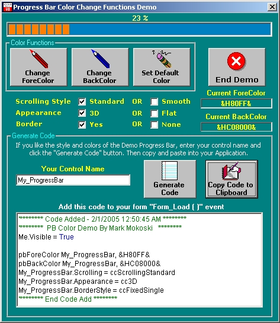

<div align="center">

## Progress Bar Color Change Functions and Code Generator App


</div>

### Description

Functions module for changing colors of the plain MS Progress Bar. There a a lot of these here on PSC, this one is a bit different as the demo application also includes a Code Generator. After you get the demo Progress Bar looking the way you want, enter your control name and click the "Generate" button. Then just copy and paste into your app. All you need to do is place the Progress Bar on your form, size it and set the min/max values, and the generated code takes care of it's good looks! Hope this is usefull for others.
 
### More Info
 


<span>             |<span>
---                |---
**Submitted On**   |2005-02-12 10:17:04
**By**             |[Mark Mokoski](https://github.com/Planet-Source-Code/PSCIndex/blob/master/ByAuthor/mark-mokoski.md)
**Level**          |Intermediate
**User Rating**    |4.0 (16 globes from 4 users)
**Compatibility**  |VB 6\.0
**Category**       |[Complete Applications](https://github.com/Planet-Source-Code/PSCIndex/blob/master/ByCategory/complete-applications__1-27.md)
**World**          |[Visual Basic](https://github.com/Planet-Source-Code/PSCIndex/blob/master/ByWorld/visual-basic.md)
**Archive File**   |[Progress\_B1851782122005\.zip](https://github.com/Planet-Source-Code/mark-mokoski-progress-bar-color-change-functions-and-code-generator-app__1-58591/archive/master.zip)

### API Declarations

```
'********************************************************
  '
  '  Progress Bar Functions
  '  31-JAN-2005
  '
  '  Mark Mokoski
  '  28-OCT-2003
  '  markm@cmtelephone.com
  '  http://www.rjillc.com
  '
  '  Set of functions to change colors of the stock
  '  (and plain) MS Common Controls Progress Bar.
  '  The fuctions are from a user control I did in 2003 for myself.
  '  But I found that I only used these functions most of the time,
  '  just changing the Foreground and Background colors.
  '  So why add "Code Bloat" with a user control when a few functions
  '  will do the job.
  '
  '**********************************************************
  Option Explicit
  Private Const WM_USER          As Long = &H400
  Private Const CCM_FIRST         As Long = &H2000
  Private Const CCM_SETBKCOLOR       As Long = (CCM_FIRST + 1)
  Private Const PBM_SETBARCOLOR      As Long = (WM_USER + 9)
  Private Const PBM_SETBKCOLOR       As Long = CCM_SETBKCOLOR
  Public Const CLR_DEFAULT         As Long = &HFF000000
  Private Declare Function SendMessage Lib "user32" Alias "SendMessageA" _
  (ByVal hwnd As Long, ByVal wMsg As Long, ByVal wparam As Long, lparam As Any) As Long
Public Function pbForeColor(ByRef pbControl As Control, ByVal pbColor As Long)
  'Set the Progress Bar ForeColor
  SendMessage pbControl.hwnd, PBM_SETBARCOLOR, 0, ByVal pbColor
End Function
Public Function pbBackColor(ByRef pbControl As Control, ByVal pbColor As Long)
  'Set the Progress Bar Backcolor
  SendMessage pbControl.hwnd, PBM_SETBKCOLOR, 0, ByVal pbColor
End Function
Public Function pbDefaultColor(ByRef pbControl As Control)
  'Set the Progress Bar to default colors
  SendMessage pbControl.hwnd, PBM_SETBARCOLOR, 0, ByVal CLR_DEFAULT
  SendMessage pbControl.hwnd, PBM_SETBKCOLOR, 0, ByVal CLR_DEFAULT
End Function
```


